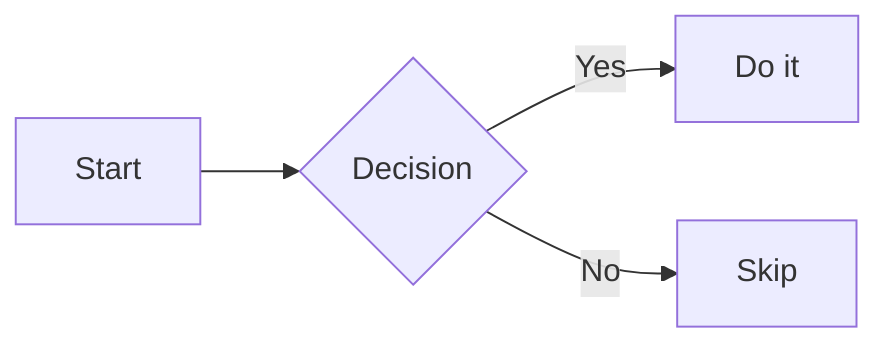
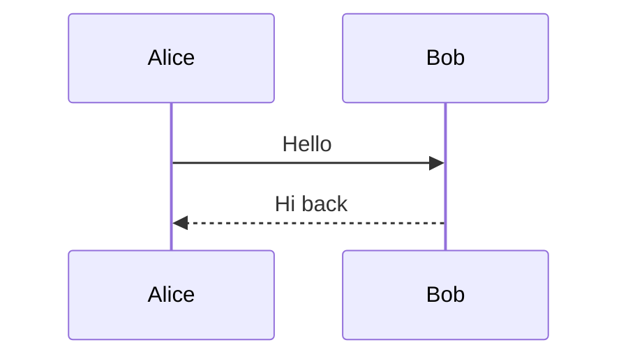
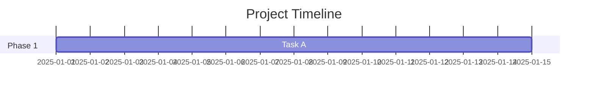
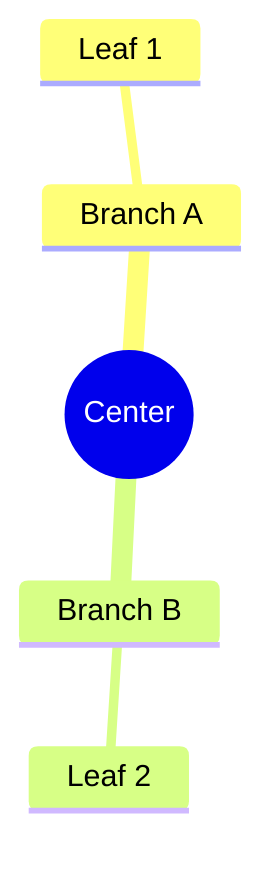

# Obsidian — Editing & Formatting Reference

## Basic Markdown Syntax

```markdown
# H1  ## H2  ### H3  #### H4  ##### H5  ###### H6
**bold**  *italic*  ~~strikethrough~~  ==highlight==
`inline code`
```code block with language tag```
- Unordered list item
  - Nested item
1. Ordered list
- [ ] Task incomplete
- [x] Task complete
| Col A | Col B |
|-------|-------|
| val   | val   |
> Blockquote
---  ← horizontal rule
<iframe src="https://example.com"></iframe>  ← embed web page
%%Obsidian comment — invisible in reading view%%
```

## Math Blocks (LaTeX)

```markdown
$$
\frac{d}{dx}(x^n) = nx^{n-1}
$$
```

Inline math: `$E = mc^2$`

## Mermaid Diagrams

Wrap in fenced code block with `mermaid` language tag.









## Callouts — All Supported Types

```markdown
> [!NOTE] Optional Title
> Content goes here.
```

| Type | Use Case |
|---|---|
| `NOTE` | General notes |
| `TIP` | Helpful tips |
| `WARNING` | Cautions |
| `INFO` | Informational |
| `SUCCESS` | Positive outcomes |
| `QUESTION` | Open questions |
| `FAILURE` | Failed outcomes |
| `DANGER` | Critical warnings |
| `BUG` | Known bugs |
| `EXAMPLE` | Examples |
| `ABSTRACT` | Summaries/TLDRs |
| `QUOTE` | Quotations |

**Foldable callouts:**
```markdown
> [!NOTE]+   ← open by default
> [!NOTE]-   ← collapsed by default
```

**Nested callouts:**
```markdown
> [!NOTE] Outer
> > [!TIP] Inner
> > Nested content
```

## Tags

```markdown
#tag                  ← inline tag
#parent/child         ← nested tag
#area/project/status  ← multi-level nesting
```

In frontmatter:
```yaml
tags: [project, ai, active]
```

## Properties (YAML Frontmatter)

```yaml
---
title: "Note Title"
aliases: [Short Name, Other Alias]
tags: [project, ai]
status: "active"
priority: 3
date: 2025-03-11
created: 2025-03-11T09:00
published: false
type: "MOC"
cssclasses: [wide-page, custom-style]
---
```

| Property | Type | Example |
|---|---|---|
| `title` | text | `"My Note"` |
| `aliases` | list | `[alias1, alias2]` |
| `tags` | list | `[project, ai]` |
| `date` | date | `2025-03-11` |
| `created` | datetime | `2025-03-11T09:00` |
| `modified` | datetime | auto via plugin |
| `status` | text | `"active"` |
| `type` | text | `"MOC"` |
| `published` | boolean | `true` |
| `priority` | number | `3` |
| `cssclasses` | list | `[wide-page]` |

## Attachments & Embeds

```markdown
![[image.png]]            ← embed image
![[image.png|300]]        ← embed with width
![[image.png|300x200]]    ← embed with width and height
![[audio.mp3]]            ← embed audio
![[video.mp4]]            ← embed video
![[document.pdf]]         ← embed PDF
```

## Editing Modes

| Mode | Description |
|---|---|
| **Source mode** | Raw markdown — no rendering |
| **Live Preview** | Rendered while editing (default) |
| **Reading view** | Fully rendered, no editing |

## Power Editing Features

- **Folding:** Collapse headings and list items via the fold arrow or `Ctrl+Shift+[`
- **Multiple cursors:** `Ctrl+click` to place cursors; `Ctrl+Alt+↑/↓` to add cursors above/below
- **Column selection:** `Alt+drag`
- **Undo/Redo:** `Ctrl+Z` / `Ctrl+Shift+Z`

## Accepted File Types

| Category | Extensions |
|---|---|
| Notes | `.md` |
| Database | `.base` |
| Canvas | `.canvas` |
| Documents | `.pdf` |
| Images | `.png`, `.jpg`, `.jpeg`, `.gif`, `.svg`, `.webp`, `.bmp` |
| Audio | `.mp3`, `.wav`, `.ogg`, `.m4a`, `.flac` |
| Video | `.mp4`, `.webm`, `.ogv`, `.mov`, `.mkv` |